# 1. Configure Event Mesh Queues in SAP Integration Suite 

In this exercise, you'll create message queues using the Event Mesh capability of SAP Integration Suite. These queues persist messages until they are consumed by the subscribed application.
A message queue can subscribe to multiple topics, determining which events are delivered to the queue.

 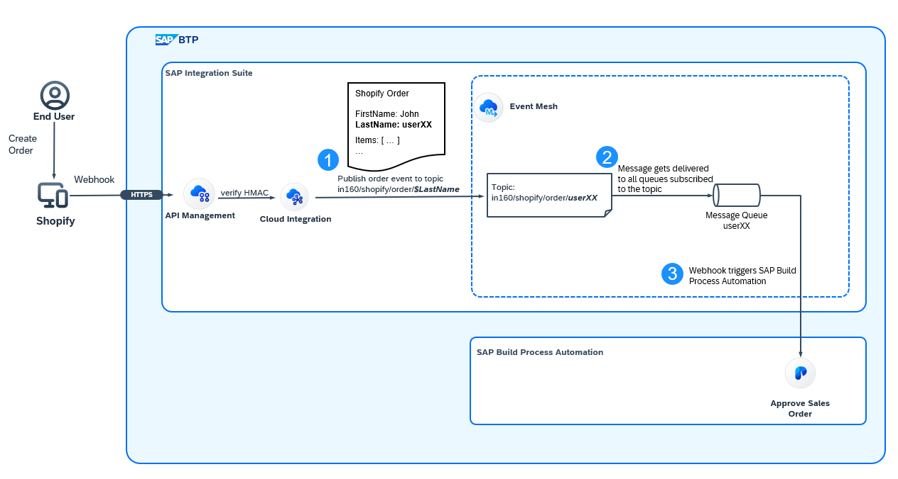

1. In the previous section, you were introduced to a generic Integration Flow that publishes incoming order events to dynamic topics, based on the userID from Shopify order.
2. In this exercise, you will create a message queue and add a topic subscription for Shopify orders. 
3. To test the setup, you will create an order in Shopify and verify if the message is successfully delivered to your message queue. 

## 1.1 Create a message queue and topic subscription

>The message client is already setup in this tenant. To understand how this step is done, review the [help documentation](https://help.sap.com/docs/integration-suite/sap-integration-suite/>configure-message-client?locale=en-US).

1.	Open the[SAP Integration Suite tenant](https://workshop-eu-02a.integrationsuite-cpi033.cfapps.eu10-005.hana.ondemand.com/shell/home) and navigate to **Configure>Event Mesh**.

 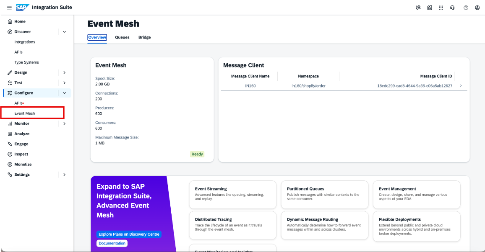

2. Click on **Message Client** "IN160".

 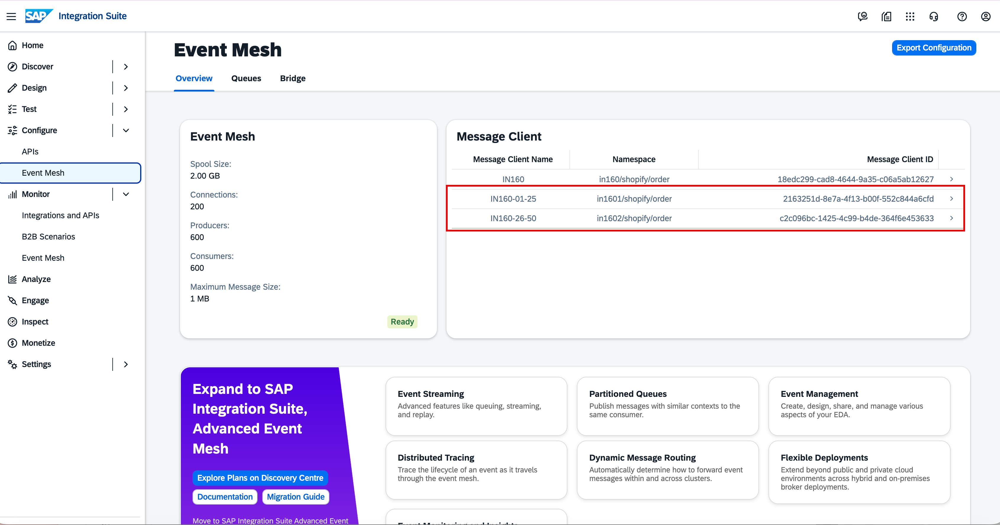

4. Navigate to the **Queues** tab and click on **Create**.

 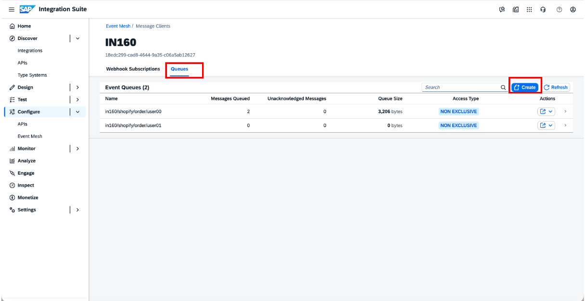

>Please make sure to set the Max Redelivery Count to **1** as otherwise there will be infinite retries in case of failed messages

5. In the dialog, provide following values: 
Namespace: `in160/shopify/order`
Name: `userXX`, where `XX` is the ID assigned to you for the workshop
Max Redelivery Count: `1`

And click **Create**.

 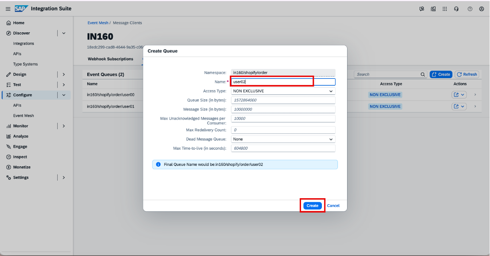

6. **Click** on the queue you just created.

 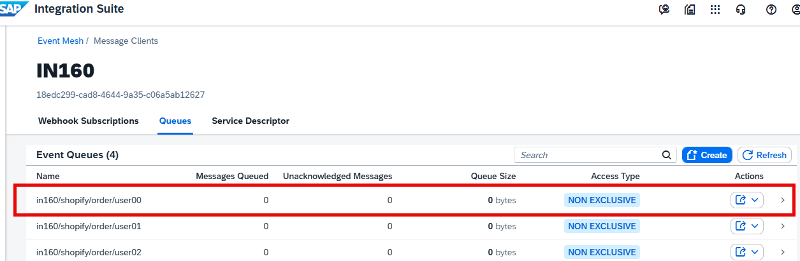

7. Switch to tab **Subscriptions** and add a new topic subscription by pressing **Create**.

 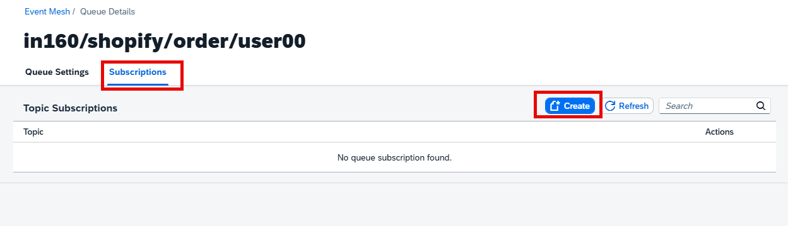

8. Provide following value for the topic subscription: `in160/shopify/order/userXX` , where `XX` is the ID assigned to you for the workshop
 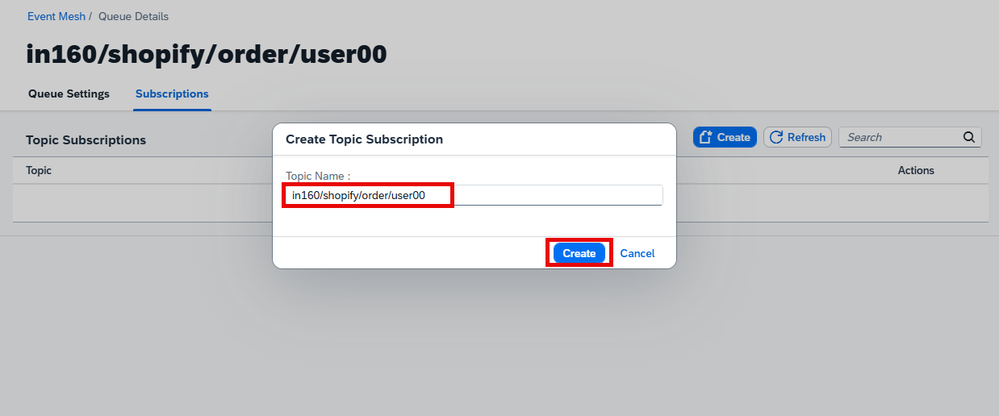

You successfully created a queue and subscribed to a topic! Let's test if the configuration works. 

## 1.2 Create order in Shopify

1. **Open** the [Shopify webshop](https://sap-teched-2025.myshopify.com/) and enter the password provided by your instructor. 

2. **Choose** a product you like and click **"Buy it now"**

3. On the checkout page, please provide following values: 

Email or mobile phone number: *Your email address or phone number* (you will receive a notification)  
Country Region: `Germany`  
First Name: *Your first name*  
Last Name: `userXX`, where `XX` is the ID assigned to you for the workshop  
Address: `Dietmar-Hopp-Alle 1`  
Postal Code: `69190`  
City: `Walldorf`  
Credit Card Number: `1`  
Expiration Date: `01/2030`  
Security Code: `123`  
Use shipping address as billing address: `True`  

And press **"Pay Now"** to submit the order. 

 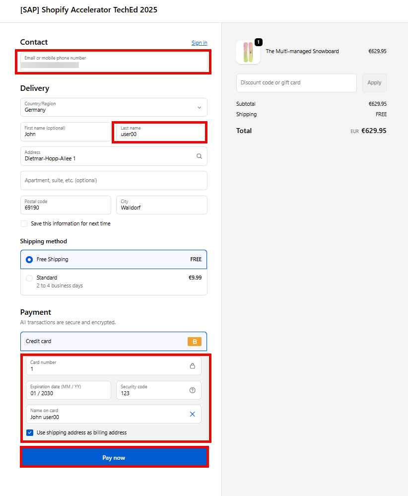

4. Your order should have been successfully processed. You will get a confirmation number. Please copy and save this number without the leading **'#'**, e.g. in a Notepad.  

 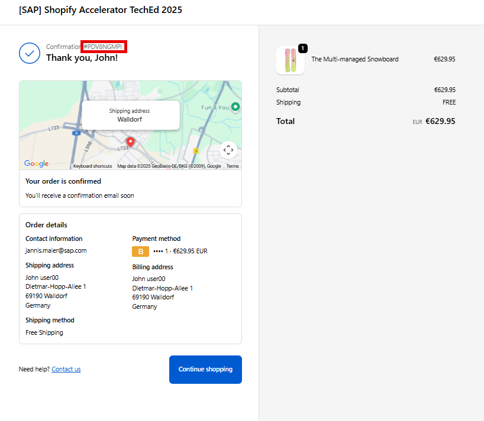

5. Let's have a look into the [SAP Integration Suite tenant](https://workshop-eu-02a.integrationsuite-cpi033.cfapps.eu10-005.hana.ondemand.com/shell/home). Navigate to **Monitor** and **Integrations and APIs**. Press the tile **All Artifacts** under **Monitor Message Processing**.

 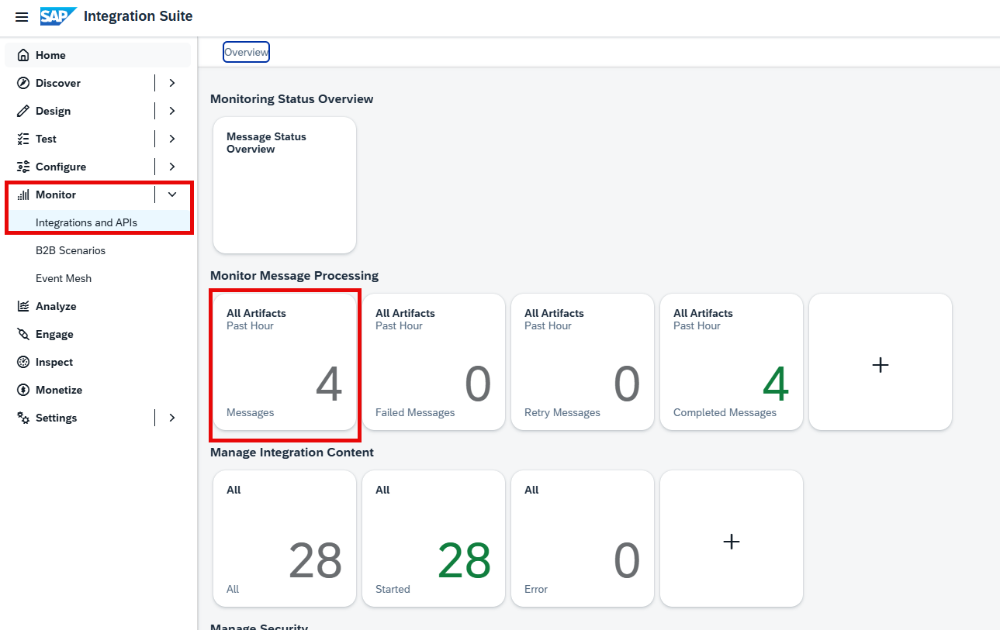

6. Expand the Monitoring filters by pressing the **Expand Icon** on the top left. Provide following value **confirmation_number=** and paste the confirmation number from step 4.
Press **Enter** to apply the filter. You now should see one entry with the topic and confirmation number of your order. 

 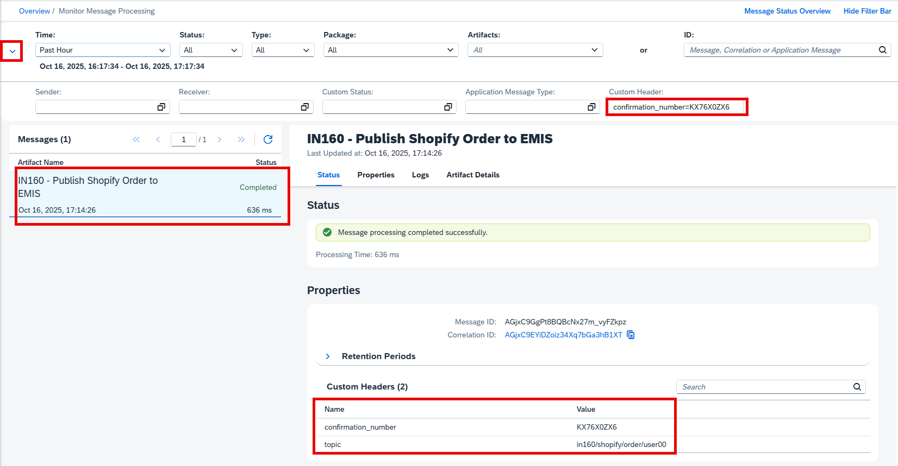

7. Next, we can check the Event Mesh queue , by navigating to **Monitor** and **Event Mesh**. **Select** your queue from the list.

 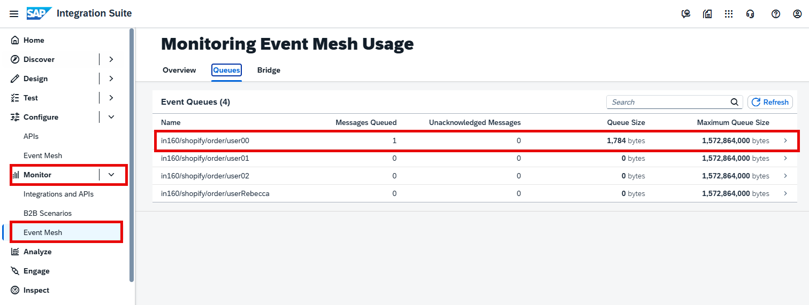

8. There should now be one message inside your queue. **Click** on it to get more details. 
 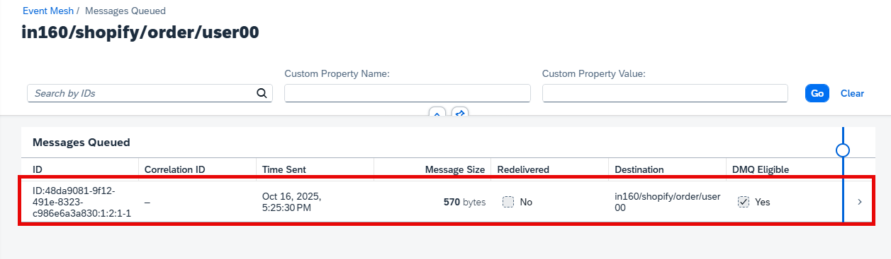

9. You now can view the message details including the payload.
 

## 1.3 Create a webhook from Event Mesh

Let's forward the event to SAP Build Process Automation by defining a webhook in the Event Mesh capability of SAP Integration Suite.
1. Navigate to your SAP Integration Suite tenant

1.	In SAP Integration Suite, navigate to **Configure>Event Mesh**.

 

2. Click on **Message Client: IN160**.

 

3. Go to the **Webhook Subscriptions** tab and click on **Create**. 

 

Provide webhook details as follows (remember to remove spaces while copy-pasting):

- **Name**: `userXX` (Replace **XX** by the user ID provided during workshop)
- **Queue name**: choose the queue that you created in step 1
- **Quality of Service**: 1
- **Webhook URL**: `https://spa-api-gateway-bpi-eu-prod.cfapps.eu10.hana.ondemand.com/internal/be/v1/events`
- **Authentication**: `oAuth2 Client Credentials`
- **Client ID**: `sb-899a0150-8fc6-4b79-948e-9683254f2c26!b583795|xsuaa!b120249`
- **Client Secret**: `5d84187a-1728-4c27-ae6b-1c62a6fe22b8$Y5GJG7LMK0k2y4goFdMf7M4C62as6ry9rxF0HUVTK0g=`
- **Token URL**: `https://workshop-eu-02a.authentication.eu10.hana.ondemand.com/oauth/token`

And click **Create**.

 

Now you successfully created a webhook and send the event to SAP Build Process Automation. In exercise 3 you will create a Process which is triggered by this event.

# Summary

Congratulations! You successfully finished the first exercise.

You've now configured your message queue to receive order events from Shopify and forward it to SAP Build Process Automation. 
But before we jump to SAP Build Process Automation, we continue to develop the integration flow responsible for order replication to SAP S/4HANA .

Now, continue to: [Exercise 2 - Replicate approved sales order to Shopify and SAP S/4HANA](../ex3/README.md).

